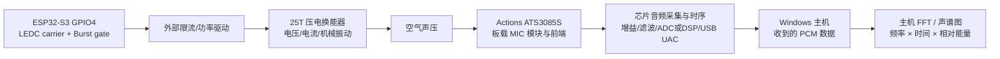

这篇文章记录一次从“让 ESP32-S3 输出一段可控的超声载波”开始，到“在 Windows 宿主机上用串口网页控制，再用 Actions ATS3085S 评估板的板载 MIC 采集链路观察频率随时间变化”的完整实验。重点不是把某个低频峰值简单地命名为“超声频率”，而是把信号链每一层的物理量分开：

```text
ESP32-S3 GPIO4 逻辑波形
        ↓
外部限流/功率驱动级
        ↓
25T 压电换能器的端电压与电流
        ↓
空气中的声压波
        ↓
Actions 芯片板载 MIC 模块与前端
        ↓
Actions 芯片音频采集/USB UAC PCM
        ↓
Windows 主机 FFT、声谱图
        ↓
我们在网页上看到的颜色和曲线
```



如果把最后一层的声谱图直接当成 GPIO 或换能器端的真实波形，结论很容易错位。本文会同时给出理论模型、当前测试固件的真实约束、已经观察到的现象、最可能的原因，以及下一轮实验如何把它们区分开。

:::info 先给结论

当前测试固件的默认配置是：`GPIO4`、25 kHz 载波、50% 载波占空、`20 ms ON + 980 ms OFF`，也就是 1 Hz、2% 的包络。Windows Web Serial 控制页只负责下发 ESP32-S3 的串口参数；Windows 主机分析器只接收 Actions ATS3085S 评估板通过 USB UAC 上传的 MIC PCM，再进行 FFT、声谱图和相对 dB 显示。主机分析器不是原始空气声压计，也不是换能器端电压波形查看器。

在当前会话的 16 kHz UAC PCM、最高显示约 8 kHz 的主机分析链路中，25 kHz 不能被直接显示。图中看到的 3.5 kHz 左右峰值可能来自板载 MIC/模拟前端或芯片音频链路中的非线性、方波谐波、Burst 边沿、混叠、分析窗口效应或环境声音，不能单独证明换能器端的实际载波频率。这里的“16 kHz”首先是导出给 Windows 的 PCM 流配置，不应未经固件和硬件资料确认就等同于板载 MIC 元件或 Actions 芯片内部每一级的真实采样时钟。

:::

## 1. 实验对象与证据边界

### 1.1 当前硬件和软件链路

本次实验使用的是 ESP32-S3 N16R8 开发板、一个标称 25T 的压电超声换能器、外部驱动/限流级，以及一块 Actions ATS3085S 评估板。硬件发布资料中的音频页把接收器标成两端模拟 MIC：`ME9` 的器件标识为 `EM6027-32BC10&33-G`，另有一个 `MD7 = MIC` 的替代封装位；两者通过 `VMIC0` 偏置和 RC 网络接入 `INPUT0P/INPUT0N`。PADS 发布文件给这两个位都保留了 DNP 属性，因此“原理图/器件库候选型号”和“你手上这块板实际焊接的型号”仍要用 BOM、板上丝印或实物确认。Actions 芯片的固件则把该输入选择为 `AUDIO_ANALOG_MIC0`，由 ADC 音频输入链路采集，再通过 USB UAC 向 Windows 提供 PCM。

| 层次 | 当前实现 | 能证明什么 | 不能直接证明什么 |
| --- | --- | --- | --- |
| ESP32-S3 | ESP-IDF，LEDC 产生载波 | GPIO4 的逻辑频率和逻辑占空 | 换能器端电压、声压 |
| 外部驱动 | 实验台外部驱动级 | 驱动电压、电流需要单独测量 | 仅看 GPIO 不能推算功率 |
| 25T 换能器 | 压电/谐振负载 | 需要探头或示波器测端电压/电流 | 不能由型号名称保证精确 25 kHz |
| Actions ATS3085S 模拟 MIC | 原理图候选为 `EM6027-32BC10&33-G` / `MIC` 替代位；属于两线模拟电容麦克风，不是 PDM 数字 MIC | 麦克风、安装位置和前端条件下的局部声学响应 | 实际装配型号、25T 端电压/电流、绝对声压和完整超声频响 |
| `VMIC0` + `INPUT0P/INPUT0N` + Actions ADC | MIC 偏置、RC 耦合/滤波、`AUDIO_ANALOG_MIC0` 模拟通道和 ADC 把模拟电压变成芯片内部 PCM；当前采集代码输入/输出采样率均为 16 kHz | 固件规定的采样序列、增益入口、块缓冲和设备端处理后的数值 | MIC 胶囊内部响应、ADC 内部过采样/主时钟的每一级细节、未处理的模拟波形 |
| USB UAC 与 Windows 主机分析器 | 当前端到端实测导出为 16 kHz / 16-bit / mono；主机再做 RMS/Peak、FFT、声谱图和相对 dB 映射 | 导出 PCM 的频率成分随分析帧时间的相对变化 | 未校准的绝对声压、功率、声压级，以及换能器端真实波形 |

本文把“固件回报的参数”视为代码事实，把“示波器测得的 GPIO 周期”视为电气事实，把“Actions 模拟 MIC 经 ADC、USB UAC 和主机分析器显示的颜色”视为经过测量链路变换后的观测事实。三者不能混为同一个量。

### 1.2 为什么选择 GPIO4

测试固件没有继续使用 GPIO33–GPIO37，而是选择 GPIO4 作为通用输出。N16R8 类 ESP32-S3 模组常把一组高编号 GPIO 用于 Octal PSRAM；因此，通用测试应优先选择明确没有被板级存储器占用、并且开发板确实引出的 IO4。GPIO4 在这里的角色是“外部驱动级的逻辑输入”，不是 25T 换能器的功率输出端。

### 1.3 安全和边界

裸压电片不要直接接在 ESP32-S3 GPIO4 上。GPIO 只能提供低功耗逻辑电平，压电换能器在谐振和容性负载下可能产生较大的瞬态电流或反向电压；应使用限流、匹配和必要的功率驱动级，并按换能器规格和实验台条件控制电压。

超声实验还涉及人耳不可直接感知但可能对动物、结构件、传感器和周边设备造成影响的能量。实验应在受控环境中进行，避免对无关人员、动物和他人的录音设备进行干扰，也不要把“能在某个麦克风图上看到变化”宣传成对所有录音设备都有效。

## 2. 从 GPIO4 输出的载波开始

### 2.1 载波频率、周期和占空比

载波是最底层的周期波形。设载波频率为 `f_c`，一个周期为：

```text
T_c = 1 / f_c
```

当 `f_c = 25 kHz` 时：

```text
T_c = 1 / 25000 = 40 μs
```

载波占空比 `D_c` 定义为一个周期内高电平时间的比例：

```text
D_c = t_high / T_c × 100%
```

因此，理想的 25 kHz 逻辑方波大致如下：

```text
       t_high                 t_low
    <---------->           <-------->
    ┌───────────┐           ┌───────────┐
    │           │           │           │
────┘           └───────────┘           └────
    <------------ T_c = 40 μs ----------->
```

几个具体例子：

| 载波设置 | 周期 | 高电平时间 | 低电平时间 |
| --- | ---: | ---: | ---: |
| 25 kHz / 50% | 40 μs | 20 μs | 20 μs |
| 25 kHz / 49% | 40 μs | 19.6 μs | 20.4 μs |
| 25 kHz / 36% | 40 μs | 14.4 μs | 25.6 μs |
| 25 kHz / 30% | 40 μs | 12 μs | 28 μs |

这里的“载波占空”不是“发射 30% 的时间、停止 70% 的时间”。它只描述每一个 40 μs 周期里面高电平脉冲的宽度。

### 2.2 LEDC 计数分辨率与名义值

当前固件使用 LEDC 10-bit duty resolution：

```c
#define TEST_DUTY_RESOLUTION LEDC_TIMER_10_BIT
#define TEST_DUTY_MAX ((1U << 10) - 1U)
```

换算逻辑是：

```c
duty_ticks = (1024 × duty_percent) / 100
```

因为固件使用整数运算，实际 tick 会有量化误差。例如：

```text
50% → 512 / 1024 = 50.000%
49% → 501 / 1024 ≈ 48.93%
36% → 368 / 1024 ≈ 35.94%
```

网页显示的是用户输入的名义百分比；示波器看到的是经过 LEDC 时钟、预分频、整数 tick 量化和探头测量后的实际结果。LEDC 的频率、时钟源和占空分辨率存在硬件组合约束，不能假定任何频率都能同时得到任意高的 duty resolution。可参阅 Espressif 的 [ESP32-S3 LEDC 文档](https://docs.espressif.com/projects/esp-idf/en/v5.2/esp32s3/api-reference/peripherals/ledc.html)。

### 2.3 载波占空对频谱的影响

理想的单极性脉冲列不仅包含一个频率。设 GPIO 高电平为 `V`，占空为 `D_c`，其交流谐波幅度大致与下面的关系相关：

```text
|A_n| ∝ |sin(π n D_c) / n|
```

在 50% 占空时，偶次谐波的理想分量会显著减弱；当占空偏离 50%，偶次谐波和其他脉冲形状成分会改变。载波占空从 50% 调到 30%，并不会让 25 kHz 的基波幅度按 50%/30% 线性变化。

对于单极性方波，基波幅度的一个常用比例形式是：

```text
A1 = 2V × sin(πD_c) / π
```

于是：

```text
D_c = 50%：A1 ≈ 0.637V
D_c = 30%：A1 ≈ 0.515V
```

两者的基波幅度差约 1.85 dB，实际还会被换能器频率响应和驱动级改变。占空为 100% 时，单极性 GPIO 会变成持续高电平，交流载波基波反而消失；因此“占空越高，超声越强”不是普遍成立的规律。

## 3. Burst 包络：不是另一个超声频率

### 3.1 包络的定义

Burst 是对载波进行低速门控：一段时间打开载波，另一段时间关闭载波。设：

```text
t_on  = 包络开启时间，单位 ms
t_off = 包络关闭时间，单位 ms
```

那么包络周期、包络频率、包络占空分别是：

```text
T_e = t_on + t_off                         (ms)
f_e = 1000 / T_e                            (Hz)
D_e = t_on / (t_on + t_off) × 100%         (%)
```

这三个量描述的是“多久发一段”和“每段发多久”，不是 25 kHz 载波本身。

### 3.2 当前固件的参数边界

当前固件和网页共同使用以下边界：

| 参数 | 范围/约束 |
| --- | --- |
| 载波频率 | 20,000–30,000 Hz |
| 载波占空 | 10–90% |
| `t_on` | 1–100 ms |
| `t_off` | 1–10,000 ms |
| 包络关系 | `t_on <= t_off` |

最后一条意味着当前 Burst 模式的包络占空最大为 50%。例如 `20/20 ms` 是 50%，但 `40/0 ms` 的 100% 连续模式目前会被拒绝。真正支持 100% 应该在固件中增加单独的 continuous-carrier 分支，而不是让任务循环执行 `vTaskDelay(0)`。

### 3.3 常用参数的计算

| `ON/OFF` | 包络周期 | 包络频率 | 包络占空 | 每段 ON 的 25 kHz 周期数 |
| --- | ---: | ---: | ---: | ---: |
| `20/980 ms` | 1000 ms | 1 Hz | 2% | 500 |
| `20/80 ms` | 100 ms | 10 Hz | 20% | 500 |
| `12/28 ms` | 40 ms | 25 Hz | 30% | 300 |
| `20/20 ms` | 40 ms | 25 Hz | 50% | 500 |
| `4/36 ms` | 40 ms | 25 Hz | 10% | 100 |

开启期间的载波周期数为：

```text
N_on = f_c × t_on(ms) / 1000
```

例如 25 kHz、20 ms 开启时：

```text
N_on = 25000 × 20 / 1000 = 500
```

### 3.4 固定周期和固定 ON 时间是两种不同实验

如果固定 `ON=20 ms`，只增大 `OFF`，那么包络占空和包络频率会同时改变：

```text
20/980 → 1 Hz、2%
20/80  → 10 Hz、20%
20/47  → 约 15 Hz、约 30%
20/20  → 25 Hz、50%
```

这适合观察“低频重复率和暗区长度如何影响声谱图”。

如果要只比较占空，而不改变包络频率，应固定总周期。例如固定 40 ms：

```text
约 2%：1/39 ms       （受固件 1 ms 最小 ON 限制）
20%： 8/32 ms
30%： 12/28 ms
50%： 20/20 ms
```

### 3.5 载波与包络的合成表达

可以用两个函数表达总的 GPIO 波形：

```text
x_gpio(t) = V_gpio × e(t) × c(t)
```

其中：

```text
c(t)：25 kHz 载波方波，周期 T_c，占空 D_c
e(t)：包络门控函数，每个 T_e 周期内前 t_on 为 1，其余为 0
V_gpio：ESP32-S3 GPIO 的逻辑电平，约为 3.3 V 级别
```

当包络处于 ON 时，LEDC 输出载波；当包络处于 OFF 时，固件把 LEDC duty 设置为 0。包络不是把载波“变成 25 Hz”，而是让 25 kHz 载波以 25 Hz、10 Hz 或 1 Hz 的节奏成组出现。

## 4. 从 GPIO 到 25T 换能器：中间还有一整个功率系统

### 4.1 GPIO 电平不等于换能器端电压

完整的电气链路是：

```text
ESP32 GPIO4：3.3 V 级逻辑、小电流
        ↓
外部 MOSFET/推挽/半桥/专用驱动级
        ↓
换能器端：可能是更高的单端或差分电压
        ↓
压电片的电流、机械振动和声压
```

同样的 GPIO 频率和占空，在不同驱动电压、输出阻抗、串联电阻、布线和换能器安装条件下，最终声压可能完全不同。因此网页参数只描述逻辑时序，不描述声压、声功率或 dB SPL。

### 4.2 25T 是器件/系列标识，不是测量结果

“25T”通常让人联想到约 25 kHz 的换能器，但实际机械谐振频率还会受到：

- 换能器本身的制造误差；
- 负载和安装结构；
- 前后腔体和反射；
- 驱动电压和波形；
- 温度、湿度和周围材料；
- 换能器的阻抗频响。

所以 25 kHz 是一个测试起点，不是仅凭型号就能证明的终点。应在换能器端使用合适的探头测电压/电流，并使用频响覆盖 25 kHz 的声学接收器测声压。

### 4.3 谐振和余振会改变包络的视觉效果

压电换能器不是理想的瞬时开关。载波关闭后，机械系统可能继续振动一段时间；驱动级也可能存在储能、上升沿、下降沿和限流恢复过程。于是：

- 2% 或 20% 的 OFF 时间很长，系统有机会衰减到较低背景；
- 50% 时 OFF 只有 20 ms，余振可能还没有完全消失；
- 声谱图会显示更连续的亮线；
- Burst 边沿本身可能产生比稳定载波更宽的频谱成分。

这解释了为什么“低占空时亮暗很清楚”并不必然表示低占空时载波峰值更高，它也可能只是 ON/OFF 对比度更高。

## 5. Actions ATS3085S 模拟 MIC 链路究竟测到了什么

### 5.1 先确定接收端的硬件身份

这里真正有物理意义的是 Actions ATS3085S 评估板上的模拟 MIC 和芯片音频输入链路，Windows 上的页面只是最后的显示端。根据 ATS3085S/E V1.1 开发板原理图：

- `ME9` 的器件标识是 `EM6027-32BC10&33-G`，`MD7` 是一个通用 `MIC` 替代封装位；两个位在原理图网络上对应同一组 MIC 输入节点。
- PADS 发布文件把 `ME9`、`MD7` 的装配值都写成 `DNP`，所以资料能证明“设计候选和连接方式”，不能单独证明你手上这块板最终焊的是哪一个胶囊。需要板卡 BOM、板上丝印或实物照片来做最后确认。
- `EM6027` 属于两端模拟电容式麦克风，不是 PDM/I²S 数字麦克风。其一端由 `VMIC0` 提供偏置，声音造成的模拟电压变化经 RC 网络送到 `INPUT0P/INPUT0N`，再由 ATS3085S 的 `AUDIO_ANALOG_MIC0` ADC 输入通道采集。器件库的 `PARTTYPE` 还把该 MIC 的库值写成 `MAF-B6022P`，但这同样不是已核对的装配 BOM 号。

如果实物确实装的是 `EM6027` 系列，它的资料定位是普通全向模拟电容麦克风，典型规格和频响曲线面向语音/可听声段，并不是“25 kHz 超声接收器”。因此，当前链路在 25 kHz 附近出现可见的低频结果，不能解释成 MIC 对 25 kHz 基波做了准确测量；更合理的候选包括超出额定频响后的弱响应、过载/非线性、RC/ADC 链路的混叠，以及 Burst 边沿产生的宽带成分。要证明 25 kHz 本身，仍需要频响覆盖该频段且采样率足够高的独立接收器。

因此，当前这次实验的接收链路应写成：

```text
ESP32-S3 GPIO4 / 外部驱动 / 25T
                  ↓
              空气声压与结构耦合
                  ↓
ATS3085S 评估板模拟 MIC
（EM6027-32BC10&33-G / MIC 替代位）
                  ↓
VMIC0 偏置 + RC 网络
INPUT0P/INPUT0N 差分模拟输入
                  ↓
Actions AUDIO_ANALOG_MIC0 + ADC
采样率、增益、滤波、块缓冲
                  ↓
USB UAC PCM
当前导出：16 kHz / 16-bit / mono
                  ↓
Windows 主机分析器
波形、RMS/Peak、FFT、声谱图、相对 dB
```

当前工程的代码证据也对应这条链路：`audio_policy_get_record_channel_id()` 为 `AUDIO_STREAM_MIC_IN` 选择 `AUDIO_ANALOG_MIC0`，记录通道类型为 ADC；`uac_microphone_start()` 调用 `audio_record_create(..., 16, 16, AUDIO_FORMAT_PCM_16_BIT, ...)`，`audio_record.c` 再把 16 kHz 输入采样率交给 `hal_ain_channel_open()`。这段调用的 `16` 是 kHz 单位。虽然该调用处还传入了 `AUDIO_MODE_STEREO`，但当前 UAC 描述/README 和 Windows 端到端实测都是 16 kHz / 16-bit / mono；因此不能只看一个内部 API 参数就把最终 USB 导出通道数判断成双声道。这里的 16 kHz 是当前应用和导出 PCM 的采样配置，不等于 MIC 胶囊内部可能存在的模拟带宽、ADC 过采样时钟或芯片内部全部时序。

因此，主机分析器看到的不是 `p_air(t)` 的原样复制，而是一个经过模拟 MIC、Actions 芯片音频路径、USB 传输、主机缓存和分析算法之后的观测量。可以用一个更贴近当前系统的简化模型表示：

```text
p_air(t) = H_transducer{driver[x_gpio(t)]}
y_board(t) = H_board_mic{p_air(t), position, enclosure} + n(t)
z[n] = Q_action{y_board(t), gain, filter, AGC, Fs_action, timing}
x_uac[n] = UAC{z[n], Fs_export, packet_buffer}
S(t, f) = FFT{window{x_uac[n]}}
```

其中 `H_board_mic` 表示实际装配的模拟 MIC、安装结构和前端的综合响应；`Q_action` 表示 Actions 芯片内部的 ADC 采样、增益、滤波、动态处理、量化和缓冲；`UAC` 表示以 USB 音频格式输出给 Windows 的 PCM 流。当前主机能直接分析的是 `x_uac[n]`，而不是 `y_board(t)` 或芯片内部未经后处理的模拟/ADC 样本。

这也解释了为什么观测器“不可能完全准确”：它可以在同一块板、同一固件、同一位置和同一页面配置下提供很有价值的相对比较，但它不自动等于经过声学校准的绝对测量仪器。

### 5.2 采样率和奈奎斯特频率

如果导出 PCM 的采样率是 `F_s`，这个 PCM 序列可以直接无混叠表示的最高频率约为：

```text
F_N = F_s / 2
```

当前工程配置和端到端实测给出：

```text
PCM 采样率 Fs = 16000 Hz
采样位宽 = 16 bit
导出通道 = mono
主机 FFT 点数 N = 1024
频率 bin ≈ Fs / N = 15.625 Hz
```

因此，对“导出给主机的 PCM”可直接得到：

```text
F_s ≈ N × Δf
    ≈ 1024 × 15.63
    ≈ 16000 Hz
```

奈奎斯特频率约为 8 kHz，所以这一路导出 PCM 的无混叠可解释频带是 0–8 kHz；这并不自动证明板载 MIC 元件、Actions 芯片内部 ADC 或模拟前端的完整频响也恰好截止在 8 kHz。

### 5.3 25 kHz 如何混叠成低频

如果超出导出 PCM 奈奎斯特范围的分量在采样/降采样前没有被充分的抗混叠滤波抑制，采样后频率会按照采样率周期折叠。可以先把频率对 `F_s` 取模，再折叠到 `0–F_s/2`：

```text
f_alias = |f - kF_s|
```

选择合适整数 `k`，让结果落在 `0–F_s/2`。当 `F_s=16 kHz` 时：

```text
25 kHz → |25 - 2×16| kHz = 7 kHz
75 kHz → |75 - 5×16| kHz = 5 kHz
125 kHz → |125 - 8×16| kHz = 3 kHz
175 kHz → |175 - 11×16| kHz = 1 kHz
```

因此，若某个超出带宽的分量确实穿过了板载 MIC/Actions 音频链路的采样环节，它可能在导出 PCM 中折叠到较低频率；但一个规范的抗混叠滤波器也可能在采样前把它大幅衰减。截图里的 3563 Hz 不是“25 kHz 被直接测成 3563 Hz”，更可能是谐波、残余混叠、板载 MIC 或芯片前端的非线性产物、Burst 瞬态、实际频率偏移或环境声音的组合。

一个简单的诊断是把载波依次改成 24、25、26 kHz，并同时记录 GPIO、25T 端和主机收到的导出 PCM。若接收链路中存在可见的直接泄漏分量，16 kHz 导出采样下它大致会向 8、7、6 kHz 移动；如果 3.5 kHz 峰值几乎不动，它就不太可能是载波基波的直接混叠。但这仍不能排除 Actions 模拟 MIC/ADC 链路在采样前已经完成了非线性解调或滤波；要区分这些情况，必须检查更高带宽的电气/声学测量。

### 5.4 非线性为什么会产生“很多频率”

理想线性接收链路只会保留输入中已有的频率成分。现实中的板载 MIC 模块、前端、Actions 芯片 ADC/DSP、增益或自动增益控制、保护器件，以及空气/结构耦合都可能引入非线性或动态处理，可以用多项式近似其中一部分：

```text
y(t) = a1 x(t) + a2 x²(t) + a3 x³(t) + ...
```

非线性会产生：

- 载波二次、三次等谐波；
- 载波与环境声音的和频/差频；
- 载波与包络的解调分量；
- 快速 Burst 边沿造成的宽带瞬态；
- ADC 或模拟前端削顶后产生的宽频谐波。

如果输入是一个高频载波和一个低频包络的乘积，频域上会出现卷积关系。理想情况下，包络会在载波两侧形成边带；如果接收链路存在非线性，还可能把载波和包络变成可被当前低带宽 PCM 看到的低频成分：

```text
f_c ± k f_e
```

但“看到很多亮色”不等于“所有频率都同样强”。真正显示出来的频谱仍受换能器频响、板载 MIC 频响、Actions 芯片增益/滤波/AGC、导出采样和混叠、窗函数、噪声底、主机分析窗口以及显示色阶影响。要判断是否真的进入非线性区，应同时检查板端 PCM 是否削顶、降低 25T 驱动后频谱是否按比例收敛、关闭或固定 AGC（若固件允许），以及改变载波后哪些峰跟着移动。

### 5.5 为什么这个观测器只能作为“相对观测”

这条链路至少有四套时间和幅度尺度：

| 环节 | 主要尺度 | 对结果的影响 |
| --- | --- | --- |
| ESP32-S3 LEDC | GPIO 外设时钟 | 载波周期稳定，但只代表 GPIO 逻辑电平 |
| ESP32-S3 Burst 任务 | FreeRTOS 毫秒级调度 | ON/OFF 边沿存在任务和 tick 级时序误差 |
| Actions ATS3085S 音频链路 | 芯片自己的音频采样时钟、块大小、增益和内部处理 | 决定板载 MIC 数据怎样被采样、滤波、分块和输出 |
| Windows 主机分析器 | USB 包、主机缓存、轮询、FFT 窗口和 hop | 决定页面显示的时间延迟、平滑程度和频率/时间分辨率 |

所以页面横轴的时间是“分析帧被处理或显示的时间”，不是 ESP32 GPIO 边沿的绝对时间戳；页面看到的亮暗变化与 GPIO 包络之间还可能有声传播延迟、机械余振、芯片音频缓冲和主机处理延迟。若要做严格时序对齐，应把 GPIO/25T 端示波器触发信号和 Actions 板输出的原始 PCM 同时录下，再用触发点或互相关估计延迟，而不能只凭浏览器刷新时刻对齐。

幅度也一样：页面的相对 dB 可以比较同一链路中“改变参数前后”的变化，但板载 MIC 灵敏度、安装方向、距离、外壳共振、芯片增益/AGC、量化、削顶和页面自动色阶都会改变读数。没有声压校准器、已知灵敏度和完整频响曲线，就不能把页面上的 dB 直接写成 dB SPL、瓦特或 25T 声功率。

## 6. FFT 和声谱图的区别

### 6.1 当前 FFT 频谱

当前 FFT 表示“Actions 板载 MIC 链路输出到主机的一小段 PCM 时间窗口”内的频率分布：

```text
横坐标：频率
纵坐标：幅度或功率的 dB 表示
只代表当前这一小段时间
```

离散傅里叶变换可以写成：

```text
X[k] = Σ x[n] w[n] exp(-j 2πkn/N)
```

其中 `w[n]` 是窗函数。当前主机分析器使用 1024 点 Hann 窗时，导出 PCM 的频率 bin 间距约为 15.63 Hz，但这不意味着实际频率测量误差必然只有 15.63 Hz；窗函数主瓣宽度、信噪比、峰值插值、Actions 芯片输出的时序稳定性和信号是否稳定都会影响读数。这个参数描述的是主机 FFT，不是板载 MIC 元件本身的“频率分辨率”。

### 6.2 声谱图

声谱图是连续地对多个“已由 Actions 板载 MIC 链路输出的 PCM 时间窗口”做 FFT，再把结果排列起来：

```text
横坐标：时间
纵坐标：频率
颜色：该时间-频率格子的能量，通常用 dB 映射
```

可以写成：

```text
S(t, f) = |FFT(windowed_x_uac_at_time_t)|²
```

因此，声谱图里的颜色不是“占空百分比”，而是主机分析器在一个时间窗口内对导出 PCM 的某个频率带计算后再映射出来的相对能量。它已经包含了板载 MIC、Actions 芯片音频处理、USB PCM 格式、FFT 窗函数和页面色阶的影响。若网页使用当前 FFT 帧相对能量或自动色阶，不同实验之间的颜色甚至不能直接进行绝对比较。

### 6.3 为什么 2% 和 20% 在声谱图上特别清晰

当前 FFT 时间窗口约为：

```text
1024 / 16000 = 64 ms
```

对固定 `ON=20 ms` 的实验：

| 包络 | OFF 时间 | 与 64 ms 窗口的关系 | 典型视觉结果 |
| --- | ---: | --- | --- |
| 2%：20/980 | 980 ms | 远大于窗口 | 大片暗区，亮段孤立 |
| 20%：20/80 | 80 ms | 略大于窗口 | 亮暗变化清楚 |
| 30%：约 20/47 | 47 ms | 小于窗口 | 亮暗开始被平均 |
| 50%：20/20 | 20 ms | 远小于窗口 | 容易接近连续亮线 |

这不是包络失效，而是短时 FFT 的时间平均效应。要看 20 ms Burst 的边沿，应减小 FFT 点数，例如 256 点对应约 16 ms 的时间窗，但频率分辨率会降低到 62.5 Hz/bin；这是时间分辨率和频率分辨率之间的基本权衡。

### 6.4 亮线、竖条和宽带颜色分别意味着什么

- **水平亮线**：某个频率成分在一段时间内持续存在。
- **水平亮线亮度周期性变化**：这个频率被包络调制。
- **竖向宽带亮条**：Burst 开始/结束、点击、机械冲击或其他瞬态。
- **从低频到高频都一起变亮**：可能是瞬态、削顶、噪声、自动增益或显示色阶，不应直接解释为“所有频率都被超声激发”。
- **固定频率线不随载波变化**：更可能是环境声音、设备固定噪声或非载波相关产物。

## 7. 当前串口固件和网页上位机

### 7.1 串口协议

当前 ESP32-S3 固件使用 UART 8N1，默认 115200 baud。支持的命令如下：

| 命令 | 作用 | 示例 |
| --- | --- | --- |
| `status` | 返回当前参数和运行状态 | `status` |
| `freq` | 设置载波频率 | `freq 25000` |
| `duty` | 设置载波占空 | `duty 50` |
| `burst` | 设置包络 ON/OFF | `burst 20 980` |
| `start` | 开始门控输出 | `start` |
| `stop` | GPIO4 拉低并停止 | `stop` |
| `help` | 打印帮助 | `help` |

典型状态回报如下：

```text
freq=25000 Hz, carrier_duty=50%, burst=20ms/980ms, envelope=2%, running=yes
```

这里的 `carrier_duty` 是载波占空，`envelope` 是包络占空，两者必须分开理解。

### 7.2 网页上位机的两个本地页面

| 主机端工具 | 作用 |
| --- | --- |
| Windows Web Serial 控制页 | 通过串口下发 ESP32-S3 的载波、占空和 Burst 参数 |
| Windows 主机分析器 | 接收 Actions ATS3085S 模拟 MIC 链路导出的 PCM，并显示波形、FFT、声谱图和相对 dB |

两个页面彼此独立，可以同时打开，但 ESP32-S3 的串口不能同时被其他串口监视器占用。Web Serial 页面应使用 Windows Chrome 或 Edge 打开，浏览器串口选择框会让用户选择 ESP32-S3 对应的 COM 口。

### 7.3 “参数跳来跳去”的网页问题

最初的网页每 2 秒发送一次 `status`，并在收到状态后把设备参数写回输入框。这样会产生一个竞态：

```text
用户正在编辑网页参数
        ↓
自动 status 返回旧设备值
        ↓
旧值覆盖了尚未应用的新值
```

网页随后做了三项修正：

1. 未点击应用的输入被标记为 dirty，状态轮询只更新设备状态卡，不再覆盖输入框。
2. 串口写入使用队列，避免 `status` 和 `freq/duty/burst` 交错写入。
3. 增加“实时应用”模式，调节停止约 350 ms 后自动发送一组参数；手动模式仍需点击“应用参数”。

这解决的是网页交互和命令时序问题，不等于让声学系统变成硬实时。当前固件的载波由 LEDC 硬件产生，而 Burst 的毫秒级开关由 FreeRTOS 任务延时参与，边沿仍可能有 tick 级抖动。

## 8. 对已经观察到现象的完整解释

| 现象 | 首要解释 | 还需要怎样验证 |
| --- | --- | --- |
| 页面参数会跳回旧值 | 自动 `status` 覆盖未应用输入 | 看更新后的 dirty 状态和串口日志 |
| 30% 和 50% 感觉接近 | 平均能量差只有约 2.2 dB，且 FFT 窗口平均、余振和 AGC 会压缩对比 | 固定色阶，比较完整包络周期 RMS |
| 2% 和 20% 的声谱图非常清晰 | OFF 间隔长，声学余振衰减，亮暗时间对比高 | 看时域包络并测实际 `t_on/t_off` |
| 图上出现 3563 Hz 左右峰值 | Actions 板载 MIC/音频前端的非线性、导出 PCM 的残余混叠、谐波、Burst 瞬态或环境声 | 把载波改成 24/25/26 kHz，并同时记录 GPIO、25T 端和板端导出 PCM |
| 频谱中有很多频率一起变亮 | Burst 边沿、方波谐波、板载 MIC/芯片链路非线性、PCM 削顶、AGC 或自动色阶 | 降低驱动，检查板端 PCM 削顶，固定 dB 范围并记录增益设置 |
| 主机分析器的亮暗变化比 GPIO 慢或有延迟 | 声传播、25T 余振、Actions 音频块、USB 缓冲和 FFT 窗口共同造成 | 用 GPIO/25T 示波器触发与原始 PCM 做时间对齐 |
| 100% 包络无法稳定设置 | 当前固件规定 `ON <= OFF` 且 `OFF >= 1 ms`，最大 50% | 增加单独的 continuous-carrier 模式 |
| 载波改频但声谱图峰不动 | 该峰不是载波直接成分，可能是环境声或固定链路噪声 | 同时用示波器和高采样率超声接收器测量 |

一个特别重要的区别是：

```text
低包络占空时“看起来更清楚” ≠ 瞬时超声峰值更大
```

它常常只说明 OFF 区间足够长，显示系统能把 ON 和 OFF 分开；高包络占空时，短时 FFT 和机械余振把两者平均成一条连续的亮线。

## 9. 可复现的验证流程

### 9.1 第一步：先用串口状态确认命令真正生效

不要只看网页输入框，要看 ESP32-S3 回报的 `status`：

```text
status
freq 25000
duty 50
burst 20 980
start
status
```

预期回报应包含：

```text
freq=25000 Hz, carrier_duty=50%, burst=20ms/980ms, envelope=2%, running=yes
```

如果 status 没变，主机分析器观测到的变化就不能归因于新参数。

### 9.2 第二步：示波器测 GPIO4

在 GPIO4 或外部驱动级逻辑输入端测量：

1. 连续时间尺度下确认 ON/OFF 周期。
2. 微秒时间尺度下确认载波周期约 40 μs。
3. 测量高电平宽度，验证载波占空。
4. 不要把高压换能器端直接接普通示波器地夹；换能器端应使用合适的差分/高压探头。

示波器观测优先级高于网页状态，因为网页状态是软件设定值，示波器才是实际电气时序。

### 9.3 第三步：用固定 40 ms 包络比较占空

为了比较 20%、30%、50% 而不改变 25 Hz 包络频率：

```text
burst 8 32       → 20%
burst 12 28      → 30%
burst 20 20      → 50%
```

每组至少采集 5–10 秒。固定 Actions 评估板的板载 MIC 位置、驱动电压、载波频率和载波占空，不要同时改变多个变量。

### 9.4 第四步：正确阅读声谱图

建议记录以下设置：

- 采样率 `F_s`；
- FFT 点数 `N`；
- Hop size/重叠率；
- Hann 等窗函数；
- dB 色阶是否固定；
- 是否启用了 AGC、自动归一化或削顶保护；
- Actions ATS3085S 板载 MIC 模块及前端的频响、增益、AGC/滤波和削顶行为；
- 主机分析器收到的是原始 PCM 还是已经经过芯片端处理的 PCM；
- 导出 PCM 的采样率 `F_s`，注意它不一定等于板载 MIC 元件内部的全部时序；

如果当前导出 PCM 是 16 kHz，那么 1024 点时间窗约为 64 ms，会明显模糊 20 ms 的 Burst 边沿，可以尝试 256 或 512 点；这只改变主机分析器的时间/频率折中，不会提高板载 MIC 或 Actions 音频链路的物理带宽。若要确认 25 kHz 本身，则必须用频响覆盖 25 kHz、采样率至少 96 kHz 且明确抗混叠特性的电气或声学接收链路。

### 9.5 第五步：用数据而不是颜色比较

对于一个固定频带，可以计算每个短时窗口的带内能量：

```text
P_band(t) = Σ |X_t[k]|²,  k ∈ 目标频带
```

然后在完整包络周期上计算：

```text
D_measured = measured_on_time / measured_period
RMS_period = sqrt(mean(x[n]² over complete periods))
```

不要只比较“哪张图更黄”。色阶自动变化时，同一个绝对能量可能被绘制成不同颜色；相对 dB 图也不能直接当成校准声压图。

## 10. 进一步的信号解释

### 10.1 为什么 Burst 会产生边带

时域相乘对应频域卷积：

```text
x(t) = e(t)c(t)
X(f) = E(f) * C(f)
```

如果 `e(t)` 是周期性方波包络，`E(f)` 在包络频率的整数倍附近有分量；与载波谱卷积后，会在载波及其谐波两侧产生：

```text
f_c ± f_e
f_c ± 2f_e
f_c ± 3f_e
...
```

如果只发一个有限长度的 Burst，时间截断还会使频谱主瓣变宽，近似宽度与 `1/t_on` 相关。`t_on=20 ms` 时，宽度量级约为几十 Hz；这与 15.63 Hz/bin 的低采样 FFT 共同造成频谱扩散。

### 10.2 为什么低占空可能出现更宽的可见频谱

载波稳定段主要体现换能器和接收链路的窄带响应，而 ON/OFF 边沿包含较快的时间变化。时间变化越快，频谱越宽；因此低占空、清晰分离的 Burst 可能显示明显的宽带竖条或边沿噪声。

这并不表示低占空让 25 kHz 变成了“所有频率”。更准确的说法是：包络门控把一个稳定载波变成了带有边沿和侧带的时变信号，而接收链路又可能把超出带宽的部分混叠到可见频段。

### 10.3 平均能量、峰值能量和感知强度不是同一个指标

对于峰值声压在 ON 期间保持不变的理想门控信号：

```text
峰值声压：主要由 ON 期间的载波和驱动决定
周期平均功率：大致随 D_e 变化
周期 RMS 压力：大致随 sqrt(D_e) 变化
人耳/麦克风感觉：还受频率、响度、AGC、余振和环境反射影响
```

所以不能从“感觉差不多”反推“包络没生效”，也不能从“声谱图颜色差不多”反推“平均声能相同”。

## 11. 当前实验能下什么结论，不能下什么结论

### 已经可以确认的结论

1. ESP32-S3 固件可以通过 GPIO4 产生名义 20–30 kHz 的 LEDC 载波。
2. 载波频率和载波占空与 Burst 包络是相互独立的两个层次。
3. `20/980 ms` 是 1 Hz、2% 包络；`20/20 ms` 是 25 Hz、50% 包络。
4. 当前串口网页可以动态下发 `freq`、`duty`、`burst`、`start` 和 `stop`。
5. 声谱图的横轴是主机分析帧时间、纵轴是导出 PCM 的频率、颜色是该帧短时相对能量的可视化；它观察的是“ATS3085S 模拟 MIC → VMIC0/INPUT0P-N → ADC → 16 kHz PCM”链路的输出，不是空气声压原样。
6. 当前会话的 16 kHz UAC PCM/0–8 kHz 主机分析链路不能直接观察 25 kHz；这不能替代对板载 MIC、Actions 芯片内部采样和抗混叠路径的硬件/固件确认。

### 还不能仅凭当前页面确认的事情

1. 25T 两端的真实电压、电流和功率。
2. 空气中的绝对声压级或声功率。
3. 25T 的实际机械谐振频率是否正好为 25 kHz。
4. 3563 Hz 峰值是否来自 25 kHz 的某个特定非线性产物。
5. 某种包络是否能对所有板载 MIC 模块、不同 Actions 固件版本、不同采样时序和所有录音设备产生同样效果。
6. 当前实验是否实现了任何广义的“录音屏蔽”。

## 12. 最终的工程心智模型

可以用下面四句话记住整个系统：

```text
载波频率决定“每秒振荡多少次”。
载波占空决定“每个载波周期内脉冲有多宽”。
包络频率决定“每秒发几段 Burst”。
包络占空决定“每个 Burst 周期有多少时间处于开启”。
```

再往后还有三次变换：

```text
GPIO 逻辑时序
  → 驱动级电压/电流
  → 换能器机械振动与空气声压
  → Actions 板载 MIC/音频采集时序/增益滤波/USB PCM
  → Windows 主机采样块、FFT、声谱图和相对 dB
```

因此，一张低采样率、经 Actions 板载 MIC 链路得到的声谱图只是整条系统在主机端的投影。它非常适合观察“是否存在周期性声学变化、Burst 是否产生亮暗结构、某些可听频段是否出现异常成分”，但不能替代 GPIO 示波器测量，也不能替代覆盖超声频段的接收器，更不能在没有校准时把相对 dB 解释成绝对声压级。

本次实验最可靠的下一步，是把三种测量同时放在一起：

1. 示波器确认 GPIO4 和外部驱动输入的实际时序；
2. 高带宽探头或超声接收器确认 25T 端的载波和包络；
3. Windows 主机分析器观察 Actions ATS3085S 模拟 MIC/ADC 链路中的混叠、非线性和低频可见结果，并把控制参数、PCM 元数据和固件版本一起记录。

只有这三层结果彼此对应，才能把“参数设置”“电气输出”“实际声学现象”和“接收页面颜色”完整地闭合起来。

## 参考资料

- [Espressif ESP32-S3 LEDC Programming Guide](https://docs.espressif.com/projects/esp-idf/en/v5.2/esp32s3/api-reference/peripherals/ledc.html)
- [ESP-IDF Programming Guide](https://docs.espressif.com/projects/esp-idf/en/stable/esp32s3/)
- Actions ATS3085S/E V1.1 开发板硬件发布资料：原理图 `ATS3085E_DEMO_DVB_V1.1_20230811`，音频页的 `MD7/ME9`、`VMIC0`、`INPUT0P/INPUT0N` 网络。
- Actions ATS308X SDK：`audio_policy.c` 的 `AUDIO_ANALOG_MIC0` ADC 通道，以及 `usb_msc_uac_demo` 的 16 kHz / 16-bit 采集配置。
- [EM6027 系列电容麦克风数据页](https://www.infinite-electronic.kr/datasheet/5b-EM-6027P.pdf)
