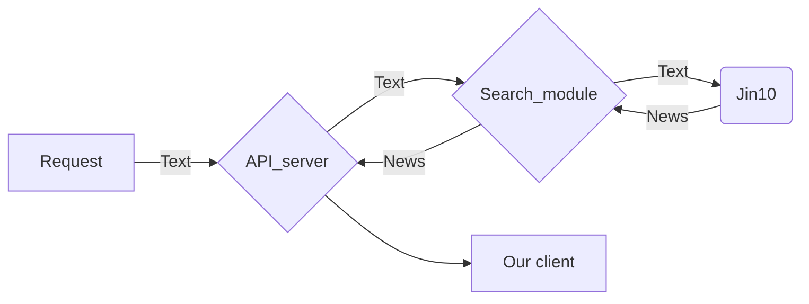

## 为什么要爬取 jin10 资讯

jin10 是一个财经信息聚合网站 ，结合财联社可以覆盖很广的实时新闻资讯

## jin10数据的爬取

### 分析



### 网页分析

F12 Network debug

我们可以看到

**/flash_newest.js** 路径下返回了大量数据 点开response可以看到里面含有新闻数据

于是我们构造curl请求来测试 ，是否可以利用其获取数据

```bash
curl "https://www.jin10.com/flash_newest.js?t=1647851271213" ^
  -H "authority: www.jin10.com" ^
  -H "sec-ch-ua: ^\^" Not A;Brand^\^";v=^\^"99^\^", ^\^"Chromium^\^";v=^\^"99^\^", ^\^"Google Chrome^\^";v=^\^"99^\^"" ^
  -H "sec-ch-ua-mobile: ?0" ^
  -H "user-agent: Mozilla/5.0 (Windows NT 10.0; Win64; x64) AppleWebKit/537.36 (KHTML, like Gecko) Chrome/99.0.4844.74 Safari/537.36" ^
  -H "sec-ch-ua-platform: ^\^"Windows^\^"" ^
  -H "accept: */*" ^
  -H "sec-fetch-site: same-origin" ^
  -H "sec-fetch-mode: no-cors" ^
  -H "sec-fetch-dest: script" ^
  -H "referer: https://www.jin10.com/" ^
  -H "accept-language: zh-TW,zh-HK;q=0.9,zh;q=0.8,en;q=0.7,zh-CN;q=0.6,en-GB;q=0.5,en-US;q=0.4" ^
  -H "cookie: sound=1; notify=2; jinSize=normal; kind_g=^%^5B^%^223^%^22^%^2C^%^227^%^22^%^5D; trend=1; x-token=; UM_distinctid=17f3909bf905e1-028195c3436eaa-a3e3164-144000-17f3909bf91a26; CALENDAR_FAVOR_INDEX_LIST=^%^5B^%^5D; Hm_lvt_522b01156bb16b471a7e2e6422d272ba=1645929399,1646661818,1647849667; Hm_lpvt_522b01156bb16b471a7e2e6422d272ba=1647849667; CNZZDATA1000171913=1230279298-1645928760-^%^7C1647841433; CNZZDATA1253039837=1625177336-1645922780-^%^7C1647841781" ^
  --compressed
```

发现的确有数据返回, 确认这是一个可以使用的接口

### 项目环境依赖

```bash
pip install fastapi[all]
pip install uvicorn[standard]
```

### Python 构造请求

```python
headers = {
    'authority': 'www.jin10.com',
    'sec-ch-ua': '^\\^',
    'sec-ch-ua-mobile': '?0',
    'user-agent': 'Mozilla/5.0 (Windows NT 10.0; Win64; x64) AppleWebKit/537.36 (KHTML, like Gecko) Chrome/98.0.4758.102 Safari/537.36',
    'sec-ch-ua-platform': '^\\^Windows^\\^',
    'accept': '*/*',
    'sec-fetch-site': 'same-origin',
    'sec-fetch-mode': 'no-cors',
    'sec-fetch-dest': 'script',
    'referer': 'https://www.jin10.com/',
    'accept-language': 'zh-TW,zh-HK;q=0.9,zh;q=0.8,en;q=0.7,zh-CN;q=0.6,en-GB;q=0.5,en-US;q=0.4',
    'cookie': 'Hm_lvt_522b01156bb16b471a7e2e6422d272ba=1645929399; sound=1; notify=2; jinSize=normal; kind_g=^%^5B^%^223^%^22^%^2C^%^227^%^22^%^5D; trend=1; x-token=; UM_distinctid=17f3909bf905e1-028195c3436eaa-a3e3164-144000-17f3909bf91a26; CNZZDATA1000171913=1230279298-1645928760-^%^7C1645928760; CNZZDATA1253039837=1625177336-1645922780-^%^7C1645922780; Hm_lpvt_522b01156bb16b471a7e2e6422d272ba=1645929551',
}

params = (
    ('t', '1645929628705'),
)

latest_msg = ""

def get_jin10_news(_n,msg_get):
   
    response = requests.get('https://www.jin10.com/flash_newest.js', headers=headers, params=params)
    clean_data = response.text.replace('var newest = ',"")[:-1]
    clean_data = json.loads(clean_data)
```

### Python 后端搭建

这里选择最简洁的异步框架fastapi来实现

```python
def get_jin10_news(_n,msg_get):
   
    response = requests.get('https://www.jin10.com/flash_newest.js', headers=headers, params=params)
    clean_data = response.text.replace('var newest = ',"")[:-1]

    clean_data = json.loads(clean_data)

    for i in range (0,_n):
        msg_get.append(clean_data[i]['data']['content'])
    return msg_get

app = FastAPI()
app.add_middleware(
    CORSMiddleware,
    allow_origins=["*"],
    allow_credentials=True,
    allow_methods=["*"],
    allow_headers=["*"],
)

@app.get("/{nn}")
def get_jin10(nn):
    msg_get = []
    nn = int(nn)
    get_jin10_data = get_jin10_news(nn,msg_get)
    print(get_jin10_data)
    return get_jin10_data
    # return json.dumps(get_jin10_data)
```

测试地址 最后两位数是返回新闻的条数
<http://49.234.208.23:1234/jin10/20>

### 完整代码

```bash

import json 
from fastapi import Cookie, FastAPI
from typing import Optional
import requests
from fastapi import FastAPI,UploadFile,File
from fastapi.responses import JSONResponse
from fastapi.middleware.cors import CORSMiddleware
from fastapi import FastAPI, Header

headers = {
    'authority': 'www.jin10.com',
    'sec-ch-ua': '^\\^',
    'sec-ch-ua-mobile': '?0',
    'user-agent': 'Mozilla/5.0 (Windows NT 10.0; Win64; x64) AppleWebKit/537.36 (KHTML, like Gecko) Chrome/98.0.4758.102 Safari/537.36',
    'sec-ch-ua-platform': '^\\^Windows^\\^',
    'accept': '*/*',
    'sec-fetch-site': 'same-origin',
    'sec-fetch-mode': 'no-cors',
    'sec-fetch-dest': 'script',
    'referer': 'https://www.jin10.com/',
    'accept-language': 'zh-TW,zh-HK;q=0.9,zh;q=0.8,en;q=0.7,zh-CN;q=0.6,en-GB;q=0.5,en-US;q=0.4',
    'cookie': 'Hm_lvt_522b01156bb16b471a7e2e6422d272ba=1645929399; sound=1; notify=2; jinSize=normal; kind_g=^%^5B^%^223^%^22^%^2C^%^227^%^22^%^5D; trend=1; x-token=; UM_distinctid=17f3909bf905e1-028195c3436eaa-a3e3164-144000-17f3909bf91a26; CNZZDATA1000171913=1230279298-1645928760-^%^7C1645928760; CNZZDATA1253039837=1625177336-1645922780-^%^7C1645922780; Hm_lpvt_522b01156bb16b471a7e2e6422d272ba=1645929551',
}

params = (
    ('t', '1645929628705'),
)

latest_msg = ""

def get_jin10_news(_n,msg_get):
   
    response = requests.get('https://www.jin10.com/flash_newest.js', headers=headers, params=params)
    clean_data = response.text.replace('var newest = ',"")[:-1]

    clean_data = json.loads(clean_data)

    for i in range (0,_n):
        msg_get.append(clean_data[i]['data']['content'])
    return msg_get

app = FastAPI()
app.add_middleware(
    CORSMiddleware,
    allow_origins=["*"],
    allow_credentials=True,
    allow_methods=["*"],
    allow_headers=["*"],
)

@app.get("/{nn}")
def get_jin10(nn):
    msg_get = []
    nn = int(nn)
    get_jin10_data = get_jin10_news(nn,msg_get)
    print(get_jin10_data)
    return get_jin10_data
```

### 后续

返回的是标准json文件，我们可以选择将其对接到飞书、钉钉、telegram机器人上，完成实时消息推送。