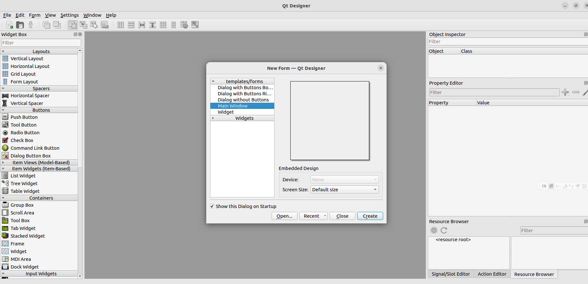
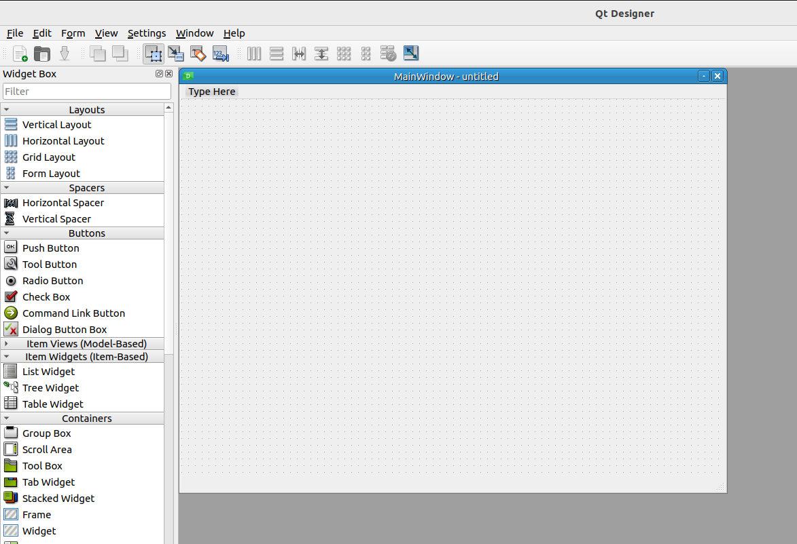
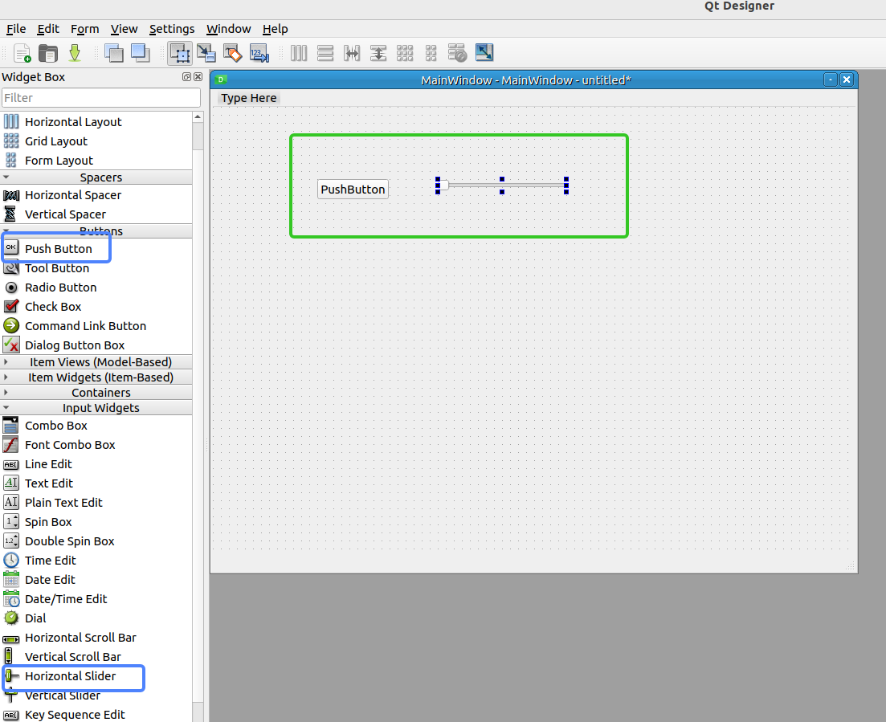
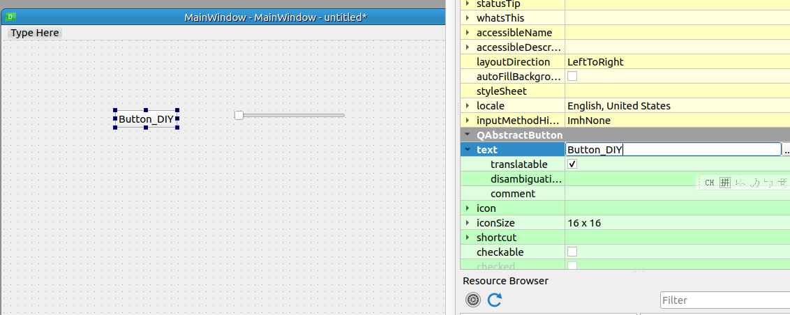
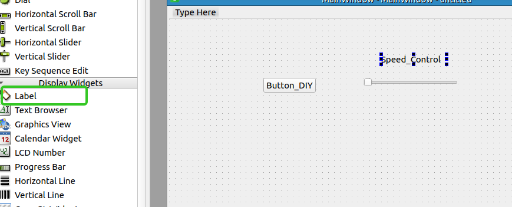
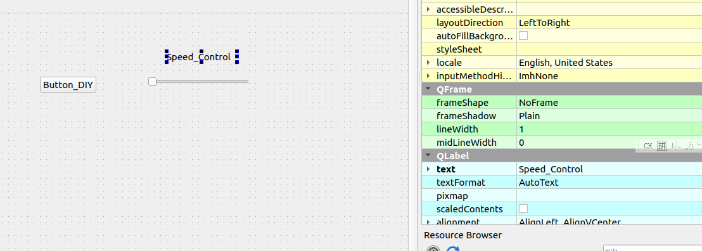
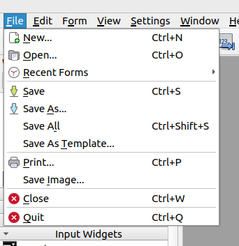
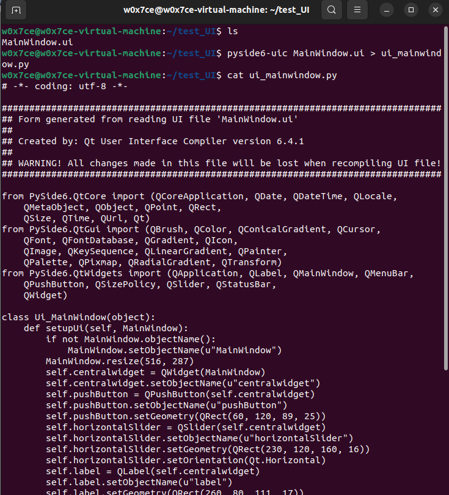
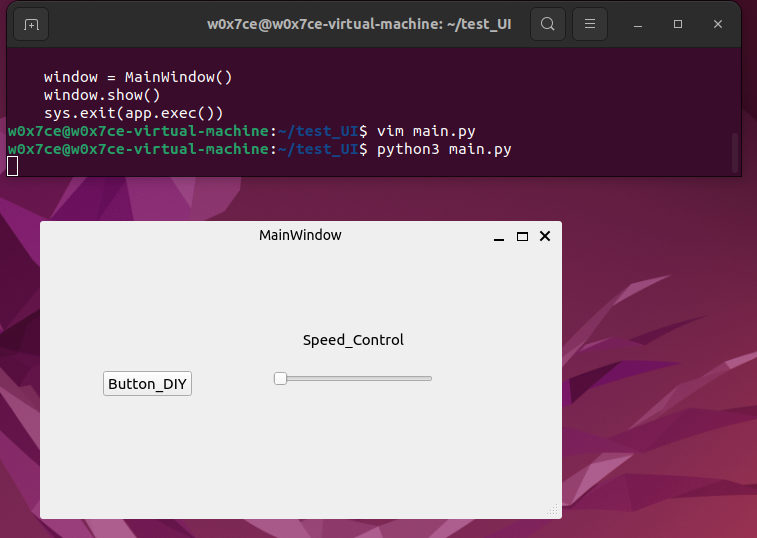

# Why Choose PySide6 for ROS GUI Dev

首先，为什么要用Python Pyside6?

ROS官方支持的开发语言包括C++和Python，并且为这两种语言提供了丰富的接口。所以选择C++或Python的图形界面开发框会非常方便。Pyside6 由QT官方支持，同时采用LGPL协议发布，使用该协议，只要以调用动态链接库的形式使用Qt（而不是静态链接），我们就可以以任何形式（商业、非商业、开源、非开源）发布自己的程序。

那为什么不使用ROS 自带的RQT 呢? 

RQT是ROS中一个基于QT的GUI开发框架, 在这个框架内可以搭载许多GUI小应用, 这些小应用也被叫做rqt_plugin. 利用这个框架就可以在同一个界面内组合多个小应用。 但是弊端也就是与ROS版本存在着较高的耦合，ros 的wiki中对于humble 等新版本开发资料较少，另外受制于RQT本身的函数封装，虽然使用方便，但是可自定义的程度远低于一个完整的图形界面开发框架。

# Software Requirements

- Ubuntu22.04
- ROS2 humble
- PySide6
- Qt Creator (Unnecessary)

# Software INSTALL

## Install PySide6

```bash
pip install PySide6
```

## Install QT Creater

Visit [www.qt.io/download-thank-you?os=linux](www.qt.io/download-thank-you?os=linux ) to Get latest version OR simply download specially version below

```bash
wget https://d13lb3tujbc8s0.cloudfront.net/onlineinstallers/qt-unified-linux-x64-4.5.1-online.run
chmod +x qt-unified-linux-x64-4.5.1-online.run
./qt-unified-linux-x64-4.5.1-online.run
```

Then click next step, Make sure install QT Creator platform.

## Install ROS2 humble

```bash
locale  # check for UTF-8

sudo apt update && sudo apt install locales
sudo locale-gen en_US en_US.UTF-8
sudo update-locale LC_ALL=en_US.UTF-8 LANG=en_US.UTF-8
export LANG=en_US.UTF-8

locale  # verify settings


sudo apt install software-properties-common
sudo add-apt-repository universe

sudo apt update && sudo apt install curl
sudo curl -sSL https://raw.githubusercontent.com/ros/rosdistro/master/ros.key -o /usr/share/keyrings/ros-archive-keyring.gpg

echo "deb [arch=$(dpkg --print-architecture) signed-by=/usr/share/keyrings/ros-archive-keyring.gpg] http://packages.ros.org/ros2/ubuntu $(. /etc/os-release && echo $UBUNTU_CODENAME) main" | sudo tee /etc/apt/sources.list.d/ros2.list > /dev/null

sudo apt update

sudo apt install ros-humble-desktop
sudo apt install ros-dev-tools
```

# Coding 

## 直接测试

代码托管在这里

https://github.com/tianrking/1_ros/blob/GUI

```bash
git clone -b  GUI https://github.com/tianrking/1_ros/blob/GUI ~/GUI
cd ~/GUI 
python3 main.py
```

## 动手实践

1. 打开 QT Designer 这就是设计界面

<p style={{textAlign: 'center'}}></p>

2. 我们选择 MainWindow模板然后点击Create 创建

<p style={{textAlign: 'center'}}></p>

就是这个样子了

3. 这时，我们可以选择并按住鼠标左键拖动 WidgetBox里面的按钮到 MainWindow内，比如我们添加一个PushButton 和一个滚动条

<p style={{textAlign: 'center'}}></p>

4. 点击PushButton 在右侧修改它的参数，我们这里给它换个名字

<p style={{textAlign: 'center'}}></p>

5. 再给滚动条边上加上名字，比如叫Speed Control 速度控制。 选择并拖动 Display Widgets里面的label到想要的位置，然后修改

<p style={{textAlign: 'center'}}></p>

<p style={{textAlign: 'center'}}></p>

6. 好了现在我们得到了一个简单的视窗，然后 File->Save as 设置保存的路径保存

<p style={{textAlign: 'center'}}></p>

7. pyside6-uic 保存文件名称.ui > 输出文件名称.py
比如我的 pyside6-uic untitled.ui > ui_mainwindow.py

<p style={{textAlign: 'center'}}></p>

这个就是生成的界面部分Python代码

8. 下面我们去调用它，查看刚刚生成的界面。
vim main.py 然后复制粘贴下边代码

```python title="main.py"
import sys
from ui_mainwindow import Ui_MainWindow
from PySide6 import QtCore, QtWidgets, QtGui
from PySide6.QtWidgets import *
import PySide6.QtCore
from PySide6.QtCore import Qt, QTimer, Slot

class MainWindow(QMainWindow):
    def __init__(self):
        super(MainWindow, self).__init__()
        self.ui = Ui_MainWindow()
        self.ui.setupUi(self)

if __name__ == "__main__":
    app = QApplication(sys.argv)

    window = MainWindow()
    window.show()
    sys.exit(app.exec())

```

9. 然后执行 

```bash 
python3 main.py
```

<p style={{textAlign: 'center'}}></p>

这样他就可以运行了

10. 添加滑条数值读取事件， 每0.1秒读取一次滑条的数值

```python title="ui_mainwindow.py"
class Ui_MainWindow(object):
    # 省略其他部分代码
    @Slot()
    def add_timer(self):
        self._timer = QTimer()
        self._timer.timeout.connect(self.handleTimeout)
        self._timer.setInterval(100)
        self._timer.start()

    def handleTimeout(self):
        print(self.horizontalSlider.value())
```

```python title="main.py"
class MainWindow(QMainWindow):
    def __init__(self):
        super(MainWindow, self).__init__()
        # 省略其他部分代码 
        self.ui.add_timer()
```


这里使用python的类来实现， 每添加一个方法 就在类中声明一个函数，然后在调用这个类的时候 调用一下这个方法就可以， 非常方便。

11. 集成 ROS

在代码头引用 rclpy 相关的包 

```python title="ui_mainwindow.py"
import rclpy
from rclpy.node import Node
from std_msgs.msg import String
from std_msgs.msg import Int32
class Ui_MainWindow(object):
    # 省略其他部分代码
    # 初始化发布节点 
    def ros_init(self):
            
        rclpy.init() # 初始化rclpy
        self.ros_node_publish_data = Node("tt_2")
        self.ros_node_publish_data_publisher_PID_Target_Speed = self.ros_node_publish_data.create_publisher(Int32,"/speed_change", 10) 

    # 定义发布函数
    @Slot()
    def handleTimeout(self):
        
        msg = Int32()  
        msg.data = int(self.horizontalSlider.value())    
        self.ros_node_publish_data_publisher_PID_Target_Speed.publish(msg) 

```

```python title="main.py"
import rclpy
from rclpy.node import Node
from std_msgs.msg import String
from std_msgs.msg import Int32
# 省略其他部分代码
class MainWindow(QMainWindow):
    def __init__(self):
        super(MainWindow, self).__init__()
        # 省略其他部分代码
        self.ui.ros_init()

```

这样就完成简单的开发了，我们可以添加更多的其它组件以丰富显示，方法大同小异。

12. 使能ROS环境

```bash
source /opt/ros/humble/setup.bash
```

再运行代码就好啦

13. 直接测试代码

```bash
git clone -b  GUI https://github.com/tianrking/1_ros/blob/GUI ~/GUI
cd ~/GUI 
pip install -r requirements.txt
source /opt/ros/humble/setup.bash
python3 main.py
```

14. 开启另一个终端

```
source /opt/ros/humble/setup.bash
ros2 topic list # 查看当前话题
ros2 topic echo /speed_change # 调节滑动条 查看输出变化
```


