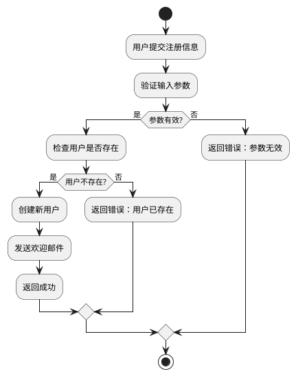

# Golang 学习指南 - 资源、工具与项目推荐

Go 语言（Golang）是 Google 开发的一种静态类型、编译型语言，具有简洁、高效、并发安全等特点。本指南将为您推荐优质的学习资源、项目实战和开发工具，助您快速掌握 Go 语言开发技能。

## Go 语言简介

### 为什么学习 Go 语言

- **简洁高效**：语法简洁，学习曲线平缓
- **高性能**：编译型语言，运行速度快
- **并发支持**：原生支持协程和通道
- **跨平台**：支持 Windows、Linux、macOS
- **云原生友好**：Kubernetes、Docker 等项目都用 Go 开发
- **活跃社区**：丰富的第三方库和工具

### Go 语言应用场景

- **后端服务开发**：API 服务器、微服务
- **云计算**：云平台组件、容器化
- **网络编程**：高并发网络服务器
- **命令行工具**：系统管理工具
- **区块链**：以太坊、Hyperledger 等项目
- **分布式系统**：etcd、Consul 等项目

## 学习路径规划

### 阶段一：基础语法（第 1-2 周）

1. **环境搭建**
   - 安装 Go 编译器
   - 配置开发环境
   - 使用 VS Code 或 GoLand

2. **基础语法**
   - 变量声明和数据类型
   - 控制结构（if、for、switch）
   - 函数定义和调用
   - 数组和切片
   - 映射（Map）
   - 结构体和方法

### 阶段二：进阶特性（第 3-4 周）

1. **接口和多态**
2. **错误处理**
3. **包管理**
4. **反射**
5. **泛型（Go 1.18+）**
6. **模块系统（Go Modules）**

### 阶段三：并发编程（第 5-6 周）

1. **协程（Goroutines）**
2. **通道（Channels）**
3. **同步机制**
4. **并发模式**
5. **并发安全**

### 阶段四：实战项目（第 7-8 周）

1. **选择项目类型**
2. **API 开发**
3. **数据库操作**
4. **测试编写**
5. **性能优化**

## 推荐学习项目

### 1. go-gin-api 项目

**项目地址**：[https://github.com/xinliangnote/go-gin-api](https://github.com/xinliangnote/go-gin-api)

**项目特点**：
- 基于 Gin 框架的 API 开发脚手架
- 包含完整的项目结构
- 集成多种中间件
- 提供 Swagger 文档
- 包含数据库操作和缓存

**学习价值**：
- 了解企业级 API 开发规范
- 学习 Gin 框架使用
- 掌握项目结构和配置管理
- 实践 RESTful API 设计

**快速开始**：

```bash
# 克隆项目
git clone https://github.com/xinliangnote/go-gin-api.git

# 进入项目目录
cd go-gin-api

# 安装依赖
go mod tidy

# 运行项目
go run main.go
```

### 2. go-gin-example 项目

**项目地址**：[https://github.com/eddycjy/go-gin-example](https://github.com/eddycjy/go-gin-example)

**项目特点**：
- Gin 框架实战示例
- 包含博客系统实现
- 详细的代码注释
- 适合初学者学习

**学习内容**：
- Gin 路由和中间件
- 数据绑定和验证
- 数据库操作
- 静态文件服务
- 日志处理

**核心示例代码**：

```go
package main

import (
    "net/http"

    "github.com/gin-gonic/gin"
)

func main() {
    r := gin.Default()

    r.GET("/", func(c *gin.Context) {
        c.JSON(http.StatusOK, gin.H{
            "message": "Hello, Go!",
        })
    })

    r.Run(":8080")
}
```

### 3. wechat-go 项目

**项目地址**：[https://github.com/songtianyi/wechat-go](https://github.com/songtianyi/wechat-go)

**项目特点**：
- Go 语言实现的微信机器人
- 支持多种功能插件
- 高并发处理
- 模块化设计

**学习价值**：
- 学习网络编程
- 掌握协议处理
- 实践插件化设计
- 了解 WebSocket 使用

**核心功能**：
- 消息收发
- 群管理
- 插件系统
- 定时任务

### 4. Gin 框架

**项目地址**：[https://github.com/gin-gonic/gin](https://github.com/gin-gonic/gin)

**框架特点**：
- 高性能 HTTP Web 框架
- 简单易用的 API
- 强大的中间件支持
- 完善的路由系统

**核心特性**：
```go
// 路由参数
r.GET("/user/:id", func(c *gin.Context) {
    id := c.Param("id")
    c.JSON(http.StatusOK, gin.H{"id": id})
})

// 查询参数
r.GET("/search", func(c *gin.Context) {
    q := c.Query("q")
    c.JSON(http.StatusOK, gin.H{"q": q})
})

// 中间件使用
r.Use(gin.Logger())
r.Use(gin.Recovery())

// 路由组
api := r.Group("/api/v1")
{
    api.GET("/users", getUsers)
    api.POST("/users", createUser)
}
```

### 5. GORM 数据库操作库

**项目地址**：[https://github.com/go-gorm/gorm](https://github.com/go-gorm/gorm)

**库特点**：
- 功能强大的 ORM 库
- 支持多种数据库
- 链式 API 设计
- 自动迁移功能

**基本使用**：

```go
type User struct {
    ID       uint   `json:"id"`
    Name     string `json:"name"`
    Email    string `json:"email"`
    CreatedAt time.Time
}

func main() {
    db, err := gorm.Open("mysql", "user:password@/dbname?charset=utf8mb4&parseTime=True&loc=Local")
    if err != nil {
        panic("连接数据库失败")
    }
    defer db.Close()

    // 自动迁移
    db.AutoMigrate(&User{})

    // 创建记录
    user := User{Name: "张三", Email: "zhangsan@example.com"}
    db.Create(&user)

    // 查询记录
    var users []User
    db.Find(&users)

    // 更新记录
    db.Model(&user).Update("Name", "李四")

    // 删除记录
    db.Delete(&user)
}
```

## 在线开发工具

### 1. JSON to Go Struct

**网站地址**：[https://mholt.github.io/json-to-go/](https://mholt.github.io/json-to-go/)

**工具用途**：
- 快速将 JSON 数据转换为 Go 结构体
- 自动生成 JSON 标签
- 支持嵌套对象和数组

**使用示例**：

```json
{
    "id": 1,
    "name": "张三",
    "email": "zhangsan@example.com",
    "address": {
        "street": "中关村大街1号",
        "city": "北京",
        "zipcode": "100000"
    }
}
```

**生成的结构体**：

```go
type Person struct {
    ID      int      `json:"id"`
    Name    string   `json:"name"`
    Email   string   `json:"email"`
    Address Address  `json:"address"`
}

type Address struct {
    Street  string `json:"street"`
    City    string `json:"city"`
    Zipcode string `json:"zipcode"`
}
```

**实际应用场景**：
- API 数据结构定义
- 配置解析
- 数据模型设计
- 第三方服务对接

### 2. YAML to Go Struct

**网站地址**：[https://zhwt.github.io/yaml-to-go/](https://zhwt.github.io/yaml-to-go/)

**工具用途**：
- 将 YAML 配置文件转换为 Go 结构体
- 支持复杂嵌套结构
- 自动生成注释

**YAML 示例**：

```yaml
server:
  host: "localhost"
  port: 8080
  ssl:
    enabled: true
    cert_file: "/path/to/cert.pem"
    key_file: "/path/to/key.pem"

database:
  type: "mysql"
  host: "localhost"
  port: 3306
  name: "mydb"
  user: "root"
  password: "password"

logging:
  level: "info"
  output: "stdout"
  format: "json"
```

**生成的结构体**：

```go
type Config struct {
    Server   Server   `yaml:"server"`
    Database Database `yaml:"database"`
    Logging  Logging  `yaml:"logging"`
}

type Server struct {
    Host string `yaml:"host"`
    Port int    `yaml:"port"`
    SSL  SSL    `yaml:"ssl"`
}

type SSL struct {
    Enabled  bool   `yaml:"enabled"`
    CertFile string `yaml:"cert_file"`
    KeyFile  string `yaml:"key_file"`
}

type Database struct {
    Type     string `yaml:"type"`
    Host     string `yaml:"host"`
    Port     int    `yaml:"port"`
    Name     string `yaml:"name"`
    User     string `yaml:"user"`
    Password string `yaml:"password"`
}

type Logging struct {
    Level  string `yaml:"level"`
    Output string `yaml:"output"`
    Format string `yaml:"format"`
}
```

**加载配置示例**：

```go
func LoadConfig(filename string) (*Config, error) {
    data, err := os.ReadFile(filename)
    if err != nil {
        return nil, err
    }

    var config Config
    err = yaml.Unmarshal(data, &config)
    if err != nil {
        return nil, err
    }

    return &config, nil
}
```

### 3. PlantUML 在线工具

**网站地址**：[https://www.dumels.com/](https://www.dumels.com/)

**工具用途**：
- 绘制 UML 图
- 系统架构设计
- 流程图绘制
- 实时协作编辑

**Go 项目架构图示例**：

```plantuml
@startuml Go项目架构

package "Controller Layer" {
  [HTTP Handler] --> [Request Validator]
  [Request Validator] --> [Service Layer]
}

package "Service Layer" {
  [User Service] --> [Repository Layer]
  [Order Service] --> [Repository Layer]
}

package "Repository Layer" {
  [User Repository] --> [Database]
  [Order Repository] --> [Database]
}

package "Model Layer" {
  class User
  class Order
  class Product
}

package "External Services" {
  [Email Service]
  [Payment Gateway]
  [Cache Layer]
}

[Service Layer] --> [External Services]

@enduml
```

**系统流程图**：



### 4. Rego 策略引擎

**网站地址**：[https://regoio.herokuapp.com/](https://regoio.herokuapp.com/)

**工具用途**：
- Open Policy Agent 策略编写
- 访问控制规则
- 合规性检查
- 策略测试和调试

**策略示例**：

```rego
package http.authz

# 允许管理员访问所有资源
allow {
    input.user.role == "admin"
}

# 允许普通用户读取自己的资源
allow {
    input.user.role == "user"
    input.method == "GET"
    input.path[0] == "users"
    input.path[1] == input.user.id
}

# 允许用户更新自己的信息
allow {
    input.user.role == "user"
    input.method == "PUT"
    input.path[0] == "users"
    input.path[1] == input.user.id
}

# 默认拒绝
default allow = false
```

**策略测试**：

```rego
package test

import data.http.authz

test_admin_can_access {
    http.authz.allow with input as {
        "user": {"role": "admin"},
        "method": "DELETE",
        "path": ["users", "123"]
    }
}

test_user_can_read_own_data {
    http.authz.allow with input as {
        "user": {"id": "123", "role": "user"},
        "method": "GET",
        "path": ["users", "123"]
    }
}
```

## 开发工具推荐

### IDE 和编辑器

1. **GoLand**
   - JetBrains 出品，功能强大
   - 智能代码提示和重构
   - 集成调试器和测试工具
   - 付费软件，有学生免费版

2. **VS Code**
   - 免费开源
   - 丰富的 Go 扩展
   - 轻量级，启动快
   - 社区活跃

3. **Vim/Neovim**
   - 键盘操作，高效编辑
   - 强大的插件生态
   - 学习曲线陡峭
   - 适合资深开发者

### 必备工具

1. **goimports**
   - 自动格式化代码
   - 管理 import 语句
   - 保持代码风格一致

2. **golint**
   - 代码质量检查
   - 发现潜在问题
   - 提供改进建议

3. **go test**
   - 内置测试框架
   - 支持基准测试
   - 集成覆盖率统计

4. **delve**
   - Go 语言调试器
   - 支持断点调试
   - 查看变量值

### 常用命令

```bash
# 创建新模块
go mod init module-name

# 下载依赖
go mod download

# 整理依赖
go mod tidy

# 格式化代码
go fmt ./...

# 运行测试
go test ./...

# 构建项目
go build -o output-name

# 安装程序
go install

# 查看依赖关系
go mod graph

# 验证模块
go mod verify
```

## 实战项目建议

### 初级项目

1. **命令行待办事项应用**
   - 使用 Cobra 框架
   - 文件存储数据
   - 掌握基础语法

2. **HTTP 代理服务器**
   - 监听端口
   - 转发请求
   - 记录日志

3. **文件压缩工具**
   - 支持多种格式
   - 命令行参数解析
   - 性能优化

### 中级项目

1. **RESTful API 服务器**
   - 使用 Gin 框架
   - 数据库集成
   - JWT 认证
   - Swagger 文档

2. **聊天应用**
   - WebSocket 实时通信
   - 用户管理
   - 消息存储

3. **图片处理服务**
   - 上传和下载
   - 图片缩放
   - 格式转换

### 高级项目

1. **微服务架构**
   - 服务发现
   - 负载均衡
   - 分布式追踪
   - 容器化部署

2. **区块链实现**
   - 区块链结构
   - 共识算法
   - 智能合约

3. **分布式缓存**
   - 一致性哈希
   - 数据分片
   - 故障转移

## 学习资源推荐

### 官方文档

- [Go 语言官方文档](https://golang.org/doc/)
- [Go 入门指南](https://tour.golang.org/)
- [Effective Go](https://golang.org/doc/effective_go.html)

### 在线教程

- [Go by Example](https://gobyexample.com/)
- [Golang tutorialspoint](https://www.tutorialspoint.com/go/)
- [Golangbot](https://golangbot.com/)

### 书籍推荐

1. **《Go 语言实战》**
   - 适合有编程基础的读者
   - 实践导向
   - 涵盖核心特性

2. **《Go 语言设计与实现》**
   - 深入 Go 内部实现
   - 源码分析
   - 适合进阶

3. **《Go 并发编程实战》**
   - 专注并发编程
   - 实际案例
   - 性能优化

### 视频教程

- B 站 Go 语言系列教程
- 慕课网 Go 语言入门
- YouTube Golang 官方频道

## 最佳实践

### 代码规范

```go
// 1. 变量命名采用驼峰式
var userName string
var isActive bool

// 2. 常量使用全大写
const MAX_SIZE = 100
const API_VERSION = "v1"

// 3. 结构体和接口命名
type UserService struct {
    // ...
}

type UserRepository interface {
    // ...
}

// 4. 函数命名采用驼峰式
func GetUserByID(id int) (*User, error) {
    // ...
}

// 5. 错误处理
func processData(data []byte) error {
    if len(data) == 0 {
        return errors.New("data is empty")
    }
    // 处理逻辑
    return nil
}
```

### 项目结构

```
project-name/
├── cmd/
│   └── main.go
├── internal/
│   ├── api/
│   ├── service/
│   ├── repository/
│   └── model/
├── pkg/
│   └── utils/
├── configs/
├── docs/
├── go.mod
└── README.md
```

### 测试规范

```go
func TestUserService_GetUserByID(t *testing.T) {
    // 准备测试数据
    userID := 1
    expectedUser := &User{ID: 1, Name: "张三"}

    // 模拟依赖
    mockRepo := new(MockUserRepository)
    mockRepo.On("GetByID", userID).Return(expectedUser, nil)

    service := NewUserService(mockRepo)

    // 执行测试
    user, err := service.GetUserByID(userID)

    // 断言结果
    assert.NoError(t, err)
    assert.Equal(t, expectedUser, user)
    mockRepo.AssertExpectations(t)
}
```

## 性能优化建议

### 1. 避免不必要的内存分配

```go
// 错误：每次循环都分配新切片
func process(data []int) []int {
    var result []int
    for _, v := range data {
        result = append(result, v*2)
    }
    return result
}

// 正确：预分配切片容量
func process(data []int) []int {
    result := make([]int, 0, len(data))
    for _, v := range data {
        result = append(result, v*2)
    }
    return result
}
```

### 2. 使用缓冲通道

```go
// 无缓冲通道
ch := make(chan int)  // 可能导致死锁

// 有缓冲通道
ch := make(chan int, 10)  // 避免阻塞
```

### 3. 避免反射

```go
// 错误：使用反射
func toJSON(v interface{}) string {
    // 反射操作性能差
}

// 正确：使用类型断言
func toJSON(v MyStruct) string {
    // 直接序列化性能好
}
```

### 4. 合理使用指针

```go
// 小型结构体：直接传值
type Point struct {
    X, Y int
}

func distance(p Point) int {
    // 传值更高效
}

// 大型结构体：使用指针
type LargeStruct struct {
    Data []byte
}

func process(data *LargeStruct) {
    // 传指针避免复制
}
```

## 常见问题解决

### 1. 编译错误

```bash
# 错误：未使用的导入
import "fmt"  // 未使用

# 解决：删除未使用的导入或使用 goimports 自动处理
```

### 2. 依赖管理

```bash
# 问题：模块版本冲突
# 解决：
go mod tidy          # 整理依赖
go mod graph         # 查看依赖关系
go mod why <module>  # 查看为什么依赖
```

### 3. 性能问题

```bash
# 使用 pprof 分析性能
go test -cpuprofile=cpu.prof -bench=.
go tool pprof cpu.prof

# 内存分析
go test -memprofile=mem.prof -bench=.
go tool pprof mem.prof
```

### 4. 并发问题

```go
// 竞争条件检测
go test -race .

// 数据竞争示例
var counter int

func increment() {
    counter++  // 竞争条件
}

// 解决：使用互斥锁
var (
    counter int
    mutex   sync.Mutex
)

func increment() {
    mutex.Lock()
    defer mutex.Unlock()
    counter++
}
```

## 总结

Go 语言是一门优秀的编程语言，特别适合云原生和高并发场景。通过本指南，您应该已经了解了：

- **学习路径**：从基础到高级的系统学习计划
- **项目实战**：推荐的开源项目和实战案例
- **开发工具**：提高开发效率的在线工具
- **最佳实践**：代码规范、性能优化、测试策略

**下一步建议**：
1. 选择一个入门项目开始实践
2. 参与开源项目贡献代码
3. 持续学习和跟进 Go 语言新特性
4. 加入 Go 语言社区，与其他开发者交流

Go 语言的学习是一个持续的过程，不断实践和总结才能真正掌握这门语言。祝愿您在 Go 语言的学习道路上取得成功！

## 进阶资源

### 开源项目参与

- [Kubernetes](https://github.com/kubernetes/kubernetes)
- [Docker](https://github.com/docker/docker-ce)
- [Prometheus](https://github.com/prometheus/prometheus)
- [Etcd](https://github.com/etcd-io/etcd)

### 技术博客

- [Go 官方博客](https://blog.golang.org/)
- [Dave Cheney 博客](https://dave.cheney.net/)
- [Uber Go 指南](https://github.com/uber-go/guide)

### 社区论坛

- [Go 中文社区](https://studygolang.com/)
- [Go Reddit](https://www.reddit.com/r/golang/)
- [Golang 中国论坛](https://gocn.vip/)
